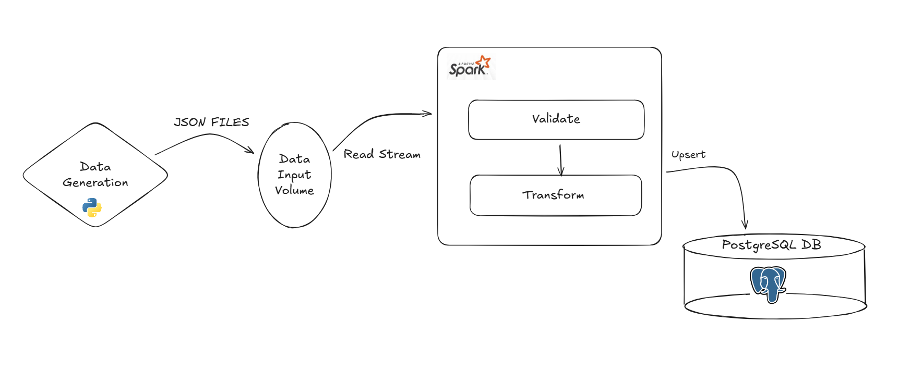

# Real-Time Data Ingestion with Spark & PostgreSQL

A production-standard real-time data pipeline simulating an e-commerce platform. This project demonstrates streaming data ingestion using Apache Spark Structured Streaming and persistent storage in PostgreSQL, fully containerized with Docker.

## Project Overview

The system simulates user activity (product views, purchases, etc.) on an e-commerce site.

1. **Source**: A Python script generates fake events (JSON) in real-time.
2. **Processing**: Apache Spark monitors the input directory, reads new files, and processes the stream.
3. **Sink**: Processed data is written transactionally to a PostgreSQL database.

## System Architecture



## Tech Stack

- **Apache Spark**: Structured Streaming processing.
- **PostgreSQL**: Relational storage.
- **Python**: Data generation (`Faker`) and PySpark.
- **Docker & Docker Compose**: Container orchestration.

## Prerequisites

- **Docker Desktop** installed and running.
- **Git** (optional, for cloning).

## Quick Start

### 1. Setup Environment

Clone the repository and navigate to the project folder.

```bash
# Clone project
git clone https://github.com/eli-bigman/spark_realtime_streaming.git

cd spark_realtime_streaming.git
```

### 2. Start Services

Launch the entire pipeline (Spark, Postgres, Data Generator) automatically:

```bash
docker compose up --build
```

_Note: You can also use `./scripts/start_pipeline.sh` for a guided startup._

### 3. Monitor Pipeline

The system starts generating and processing data immediately. Here is how to monitor it:

**A. Access Spark UI**
Go to [http://localhost:4040](http://localhost:4040) to view the streaming job status, input rates, and processing metrics.

**B. Watch Database Growth (Real-time)**

1. Connect to the database:
   ```bash
   docker exec -it postgres-db psql -U spark_user -d ecommerce_db
   ```
2. Run the count query:
   ```sql
   SELECT count(*) FROM ecommerce_events;
   ```
3. Turn on watch mode (updates every 1 second):
   ```sql
   \watch 1
   ```
   _(Press Ctrl+C to exit)_

**C. Query Data (SQL Shell)**
Connect to the database manually:

```bash
docker exec -it postgres-db psql -U spark_user -d ecommerce_db
```

Run queries:

```sql
SELECT * FROM ecommerce_events ORDER BY timestamp DESC LIMIT 5;
```

**D. View Logs**

- **Spark Job**: `docker logs -f spark-streaming-job`
- **Data Generator**: `docker logs -f data-generator`

## Project Structure

```
├── config/             # Configuration settings
│   └── settings.py
├── data/               # Data volume (gitignored)
│   ├── input/          # Generated JSON events land here
│   └── output/         # Checkpoints/logs
├── docs/               # Documentation (Overview, Guides)
├── scripts/            # Database initialization scripts
│   └── postgres_setup.sql
├── src/                # Source code
│   ├── data_generator.py
│   └── spark_streaming_to_postgres.py
├── .env                # Environment variables (Credentials)
├── docker-compose.yml  # Application orchestration
└── requirements.txt    # Python dependencies
```

## Deliverables

| Deliverable                 | File Path / Description                                                    |
| --------------------------- | -------------------------------------------------------------------------- |
| **Data Generator Script**   | [`src/data_generator.py`](src/data_generator.py)                           |
| **Spark Streaming Job**     | [`src/spark_streaming_to_postgres.py`](src/spark_streaming_to_postgres.py) |
| **PostgreSQL Setup Script** | [`scripts/postgres_setup.sql`](scripts/postgres_setup.sql)                 |
| **Connection Details**      | [`postgres_connection_details.txt`](postgres_connection_details.txt)       |
| **Project Overview**        | [`docs/project_overview.md`](docs/project_overview.md)                     |
| **User Guide**              | [`docs/user_guide.md`](docs/user_guide.md)                                 |
| **Test Cases**              | [`docs/test_cases.md`](docs/test_cases.md)                                 |
| **Performance Metrics**     | [`docs/performance_metrics.md`](docs/performance_metrics.md)               |
| **System Architecture**     | See "System Architecture" section above (Mermaid Diagram)                  |

## Testing

System tests are integrated into the Docker pipeline.

### Run Automated Tests

To run the end-to-end test suite (`pytest`), use the `test` profile:

```bash
docker compose run --rm tests
```

This will automatically execute the validation suite defined in `tests/test_pipeline.py`, covering:

1.  **Connectivity**: Verifies Spark can connect to PostgreSQL.
2.  **Schema Validation**: Ensures the `ecommerce_events` table exists.
3.  **End-to-End Ingestion**: confirm that generated JSON events are correctly processed and stored in the database.

For a detailed breakdown of all manual and automated test cases, see the [Test Plan](docs/test_cases.md).
