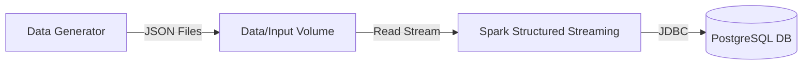

# Real-Time Data Ingestion with Spark & PostgreSQL

A production-standard real-time data pipeline simulating an e-commerce platform. This project demonstrates streaming data ingestion using Apache Spark Structured Streaming and persistent storage in PostgreSQL, fully containerized with Docker.

## Project Overview

The system simulates user activity (product views, purchases, etc.) on an e-commerce site.
1. **Source**: A Python script generates fake events (JSON) in real-time.
2. **Processing**: Apache Spark monitors the input directory, reads new files, and processes the stream.
3. **Sink**: Processed data is written transactionally to a PostgreSQL database.

## System Architecture



## Tech Stack

- **Apache Spark**: Structured Streaming processing.
- **PostgreSQL**: Relational storage.
- **Python**: Data generation (`Faker`) and PySpark.
- **Docker & Docker Compose**: Container orchestration.

## Prerequisites

- **Docker Desktop** installed and running.
- **Git** (optional, for cloning).

## Quick Start

### 1. Setup Environment
Clone the repository and navigate to the project folder.

```bash
# Verify directory structure
ls -R
```

### 2. Start Services
Launch the Spark and PostgreSQL containers in the background.

```bash
docker-compose up -d
```
Check status:
```bash
docker ps
```

### 3. Generate Data
You can run the generator locally or inside the `spark-app` container.

**Running inside container (Recommended):**
```bash
# Open a shell in the spark container
docker exec -it spark-realtime-app /bin/bash

# Run the generator
python src/data_generator.py
```
*Leave this running. It will produce JSON files in `data/input`.*

### 4. Run Spark Streaming Job
Open a **new terminal** (host or container) to submit the PySpark job.

```bash
# Inside the container
docker exec -it spark-realtime-app /bin/bash

# Submit the job (Postgres driver is handled by configuring jars)
spark-submit --packages org.postgresql:postgresql:42.7.2 src/spark_streaming_to_postgres.py
```

### 5. Verify Data in PostgreSQL
Connect to the database to confirm data ingestion.

```bash
docker exec -it postgres-db psql -U spark_user -d ecommerce_db
```

Run SQL query:
```sql
SELECT count(*) FROM ecommerce_events;
SELECT * FROM ecommerce_events ORDER BY timestamp DESC LIMIT 5;
```

## Project Structure

```
├── config/             # Configuration settings
│   └── settings.py
├── data/               # Data volume (gitignored)
│   ├── input/          # Generated JSON events land here
│   └── output/         # Checkpoints/logs
├── docs/               # Documentation (Overview, Guides)
├── scripts/            # Database initialization scripts
│   └── postgres_setup.sql
├── src/                # Source code
│   ├── data_generator.py
│   └── spark_streaming_to_postgres.py
├── .env                # Environment variables (Credentials)
├── docker-compose.yml  # Application orchestration
└── requirements.txt    # Python dependencies
```

## Deliverables

| Deliverable | File Path / Description |
|-------------|-------------------------|
| **Data Generator Script** | [`src/data_generator.py`](src/data_generator.py) |
| **Spark Streaming Job** | [`src/spark_streaming_to_postgres.py`](src/spark_streaming_to_postgres.py) |
| **PostgreSQL Setup Script** | [`scripts/postgres_setup.sql`](scripts/postgres_setup.sql) |
| **Connection Details** | [`postgres_connection_details.txt`](postgres_connection_details.txt) |
| **Project Overview** | [`docs/project_overview.md`](docs/project_overview.md) |
| **User Guide** | [`docs/user_guide.md`](docs/user_guide.md) |
| **Test Cases** | [`docs/test_cases.md`](docs/test_cases.md) |
| **Performance Metrics** | [`docs/performance_metrics.md`](docs/performance_metrics.md) |
| **System Architecture** | See "System Architecture" section above (Mermaid Diagram) |

## Testing

- **Data Generator**: Verify JSON files appear in `data/input`.
- **Database**: Check `ecommerce_events` table exists in Postgres.
- **End-to-End**: Run the pipeline and ensure row count in Postgres increases.
