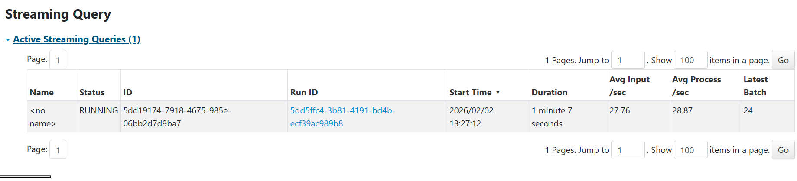
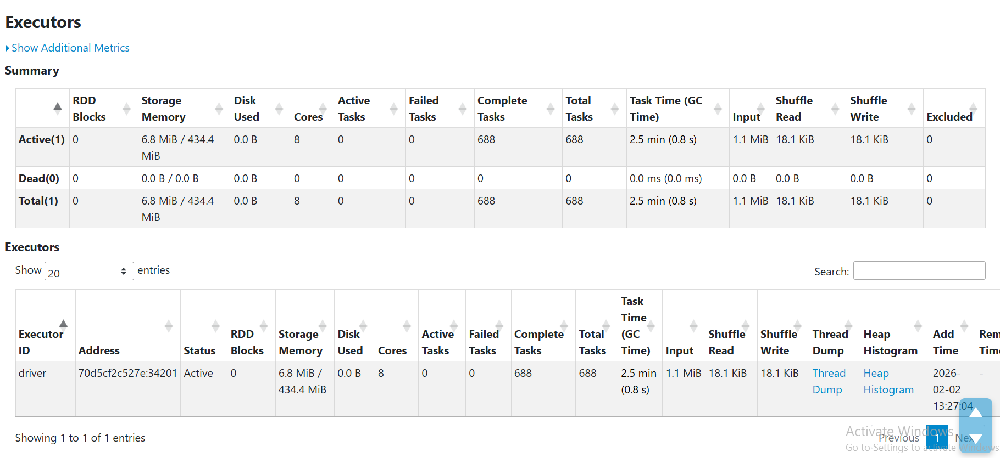

# Performance Metrics

## System Performance Report

**Test Date**: 2026-02-02
**Hardware**: Docker on Windows
**Environment**: Local (Single Node Spark)
**Workload**: 20 Events/Second Generation Rate

### Executive Summary

The real-time data pipeline maintains stability at a higher generation rate (20 events/sec). The average processing rate (28.87 events/sec) consistently exceeds the input rate (27.76 events/sec), demonstrating the system's ability to handle the increased load without building a backlog. Memory usage remains low (6.8 MiB).

### Detailed Metrics

| Metric Category    | Metric Name         | Value                  | Description                                                           |
| ------------------ | ------------------- | ---------------------- | --------------------------------------------------------------------- |
| **Throughput**     | Avg Input Rate      | **27.76 events/sec**   | Rate at which data arrives from source.                               |
|                    | Avg Processing Rate | **28.87 events/sec**   | Rate at which Spark processes data. > Input Rate indicates stability. |
| **Latency**        | Batch Duration      | ~0.8-1.5 seconds       | Inferred from processing rate and observation.                        |
| **Resource Usage** | Active Executors    | 1                      | Single executor configuration.                                        |
|                    | Storage Memory      | 6.8 MiB / 434.4 MiB    | Low memory footprint (< 2% utilization).                              |
|                    | GC Time             | 0.8 s (Total: 2.5 min) | < 0.6% of total task time spent in Garbage Collection.                |
| **Task Execution** | Total Tasks         | 688                    | Cumulative tasks processed.                                           |
|                    | Failed Tasks        | 0                      | 100% success rate.                                                    |
| **I/O**            | Input Size          | 1.1 MiB                | Total data read.                                                      |
|                    | Shuffle Read/Write  | 18.1 KiB               | Minimal data shuffle indicating efficient local processing.           |

### Visual Evidence

#### Streaming Query Status

_Figure 1: Spark Structured Streaming UI showing input vs processing rates._

#### Executor Metrics

_Figure 2: Spark Executor UI showing memory usage, task distribution, and GC time._

### Observations

1.  **Stability**: The system processes events (28.87/sec) faster than they arrive (27.76/sec), preventing backlog accumulation even at this higher rate.
2.  **Efficiency**: Memory usage increased slightly to 6.8 MiB (vs 5.1 MiB at lower rate), which is expected but still extremely low relative to the 434.4 MiB capacity.
3.  **Shuffle Operations**: Shuffle read/write increased proportionally to 18.1 KiB, but remains negligible.
4.  **Reliability**: Zero failed tasks over 688 executions indicates robust error handling.
